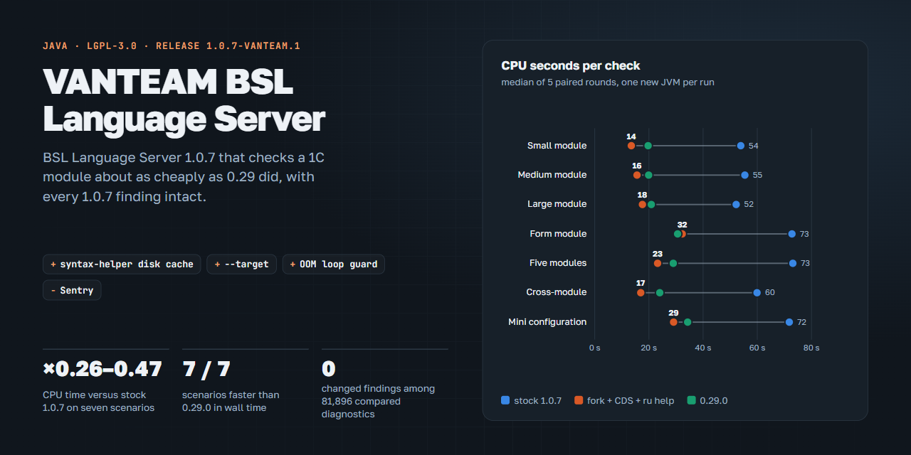

<h1 align="center">BSL Language Server — VANTEAM fork</h1>

<h4 align="center">A fork of <a href="https://github.com/1c-syntax/bsl-language-server">BSL Language Server</a> 1.0.7 with a disk cache of the 1C syntax helper: the same findings as 1.0.7 for a quarter to a half of its CPU time</h4>

<div align="center">
  <a href="https://github.com/1c-syntax/bsl-language-server"></a>
  <a href="COPYING.md"></a>
  <a href="https://github.com/1c-syntax/bsl-language-server/releases/tag/v1.0.7"></a>
</div>
<br/>

<p align="center"><a href="https://ivanbokhan84.github.io/bsl-language-server/"></a></p>

Project page with the measurement charts: **[ivanbokhan84.github.io/bsl-language-server](https://ivanbokhan84.github.io/bsl-language-server/)**.

BSL Language Server is a language server and static analyzer for the 1C:Enterprise (BSL) and OneScript languages. Since 1.0.7 it infers types from the syntax helper of the installed 1C platform — 2,495 contexts from about 75 MB of HBK files — and it parses them on every start. For a short command-line check of one module that is most of the CPU time. This fork keeps the parsed helper on disk and leaves the rules, the report formats and the configuration of BSL Language Server untouched.

Maintained by **Ivan Bokhan**, on top of BSL Language Server by the 1c-syntax community and its contributors — see [Credits](#credits).

Upstream documentation: [README-UPSTREAM.md](README-UPSTREAM.md), [the project site](https://1c-syntax.github.io/bsl-language-server), fork notes in Russian: [docs/vanteam](docs/vanteam/README.md).

## Changes from upstream

Branch `vanteam-bsl-1.1`, one commit per change on top of tag `v1.0.7`:

| Change | Commit |
|---|---|
| Disk cache of the parsed syntax helper (Kryo). The key covers the helper files (path, size, modification time, hashes of the first and last 64 KiB), BSL Language Server, bsl-context, Kryo and Java versions. A miss, a write and an unreadable entry are logged at INFO; writes are atomic; three entries are kept. | `perf(types)` |
| `analyze --target <file>` (repeatable): the whole source directory is analyzed as context, diagnostics and metrics are computed for the targets only. A target outside the source files exits with 1. | `perf(cli)` |
| An `OutOfMemoryError`, `StackOverflowError` or `LinkageError` while loading the helper no longer makes every next document parse it again: one attempt, an ERROR line, platform context off for the workspace. | `fix(types)` |
| Error reports are no longer sent to the upstream Sentry project. | `chore(vanteam)` |

## Measurements

Median CPU / wall seconds per check, seven scenarios, a new JVM per run, a warm-up and five paired rounds on 4 cores / 8 threads under 60–94% background load. All variants run with `-XX:TieredStopAtLevel=1 -XX:ActiveProcessorCount=4 -Xmx512m`; the fork adds the warm cache, an AppCDS archive of the extracted JAR and the Russian-only syntax helper.

| Scenario | 0.29.0 | 1.0.7 | this fork | fork / 1.0.7, CPU |
|---|---:|---:|---:|---:|
| Small module | 19.7 / 17.8 | 53.9 / 35.1 | **13.5 / 11.5** | ×0.26 |
| Medium module | 19.9 / 21.1 | 55.4 / 37.0 | **15.6 / 18.8** | ×0.28 |
| Large module | 20.9 / 15.9 | 52.2 / 28.9 | **17.6 / 11.8** | ×0.32 |
| Form module | 30.6 / 21.9 | 72.8 / 35.9 | **32.3 / 15.6** | ×0.47 |
| Five modules | 29.0 / 44.8 | 73.1 / 74.8 | **23.2 / 27.0** | ×0.32 |
| Cross-module | 24.0 / 30.8 | 59.9 / 40.7 | **17.0 / 11.8** | ×0.28 |
| Mini configuration | 34.3 / 33.3 | 71.8 / 45.3 | **29.1 / 19.4** | ×0.40 |

- Findings of the fork with a warm or a cold cache and with `--target` are identical to stock 1.0.7 in every scenario and on two real configurations (8,051 and 71,460 diagnostics), compared as full JSON objects.
- The fork is faster than 0.29.0 in wall time in all seven scenarios and uses no more CPU in six of them. It still needs ×1.1–1.6 the memory of 0.29.0, which does not load the helper at all.
- One launch over N modules: the fixed part is about 19 s of CPU against 62 s for stock 1.0.7, each extra module adds 0.6–0.7 s.
- Stock 1.0.7 needs `-Xmx1g` for about 600 modules: with 512 MiB it fails with `OutOfMemoryError`.
- The full upstream test suite passes on the fork: 3,666 tests, 0 failures, 31 skipped (mostly tests that need the 1C syntax helper).

Method, charts and the cache invalidation checks are on the [project page](https://ivanbokhan84.github.io/bsl-language-server/); the full story in Russian is in [docs/vanteam/bsl-check-optimization.md](docs/vanteam/bsl-check-optimization.md).

## Build and run

JDK 21 is required. The command line and the report formats are those of BSL Language Server.

```sh
git clone -b vanteam-bsl-1.1 https://github.com/ivanbokhan84/bsl-language-server.git
cd bsl-language-server
./gradlew bootJar                      # build/libs/bsl-language-server-*-exec.jar

# optional: an AppCDS archive of the extracted JAR, trained once
java -Djarmode=tools -jar build/libs/bsl-language-server-*-exec.jar extract --destination bslls
java -XX:ArchiveClassesAtExit=bslls.jsa -jar bslls/bsl-language-server-*-exec.jar --analyze --srcDir src --silent

java -XX:SharedArchiveFile=bslls.jsa -XX:TieredStopAtLevel=1 -XX:ActiveProcessorCount=4 \
     -Xmx1g -XX:+ExitOnOutOfMemoryError \
     -jar bslls/bsl-language-server-*-exec.jar --analyze --silent \
     --srcDir src --target src/CommonModules/Module1/Ext/Module.bsl --reporter json
```

`--silent` also matters on Windows: without it the progress bar makes JLine start `tty.exe` and `conhost.exe` when Git for Windows is on `PATH`.

## Configuration

| Setting | Default | Meaning |
|---|---|---|
| `app.platform-context.cache.enabled` | `true` | Use the disk cache of the parsed syntax helper |
| `app.platform-context.cache.path` | `${app.cache.basePath}/.bsl-language-server/platform-context` | Cache directory; one entry is about 23 MB |

Pass them as `-Dapp.platform-context.cache.path=D:/cache/bslls` on the Java command line. The 1C platform and the target compatibility mode are set as upstream does, in `.bsl-language-server.json` → `v8platform` (`enabled`, `binPath`, `targetVersion`).

Russian-only helper: point `v8platform.binPath` to a directory with copies of `shcntx_ru.hbk`, `shlang_ru.hbk` and `shlang_root.hbk` from the platform `bin` directory, without `shcntx_root.hbk`. The English helper (English names of signature variants and parameters) is then skipped; findings stayed identical on 79,511 diagnostics of two real configurations.

## Keeping up with upstream

```sh
git remote add upstream https://github.com/1c-syntax/bsl-language-server.git
git fetch upstream --tags
git rebase --onto vX.Y.Z v1.0.7 vanteam-bsl-1.1
./gradlew build
```

After a rebase: the full test suite and a comparison of findings with stock BSL Language Server on the same code.

## Credits

BSL Language Server is created and maintained by the [1c-syntax](https://github.com/1c-syntax) community — Alexey Sosnoviy, Nikita Fedkin and the contributors listed in the upstream repository. This fork only adds the changes listed above; improvements of general use are meant to be offered upstream.

## License

[LGPL-3.0-or-later](COPYING.md), like BSL Language Server. Texts in `docs/vanteam` are licensed under [CC BY 4.0](https://creativecommons.org/licenses/by/4.0/).
